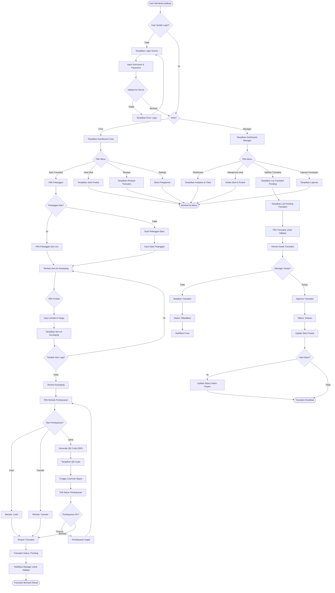
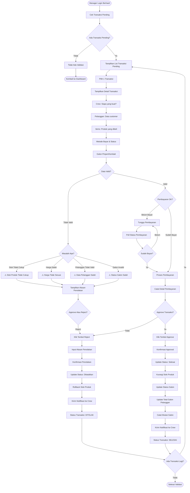
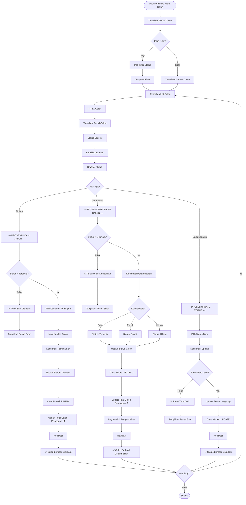
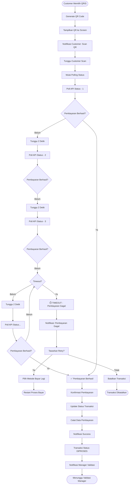

# 📊 Dokumentasi Fitur, Activity Diagram & Use Case Diagram
## Depo Air - Sistem Manajemen Depot Air

---

## 📋 DAFTAR SEMUA FITUR

### **A. FITUR AUTENTIKASI & MANAJEMEN PENGGUNA**
1. **Login Crew** - Staff depot dapat login dengan username dan password
2. **Login Manager** - Manajer dapat login dengan email dan password
3. **Logout** - Keluar dari aplikasi dan hapus session
4. **Role Selection** - Memilih role (Crew/Manager) di awal login
5. **Token Management** - Otomatis refresh token (JWT 8 jam)
6. **Persistent Login** - Menyimpan data login di storage lokal
7. **Profile Management** - Lihat dan kelola profil pengguna

---

### **B. FITUR MANAJEMEN TRANSAKSI**
1. **Buat Transaksi Baru** - Crew membuat transaksi penjualan
2. **Pilih Pelanggan** - Memilih pelanggan atau membuat pelanggan baru
3. **Tambah Item ke Keranjang** - Menambahkan produk ke transaksi
4. **Edit Item Transaksi** - Mengubah jumlah atau harga item
5. **Hapus Item Transaksi** - Menghapus item dari keranjang
6. **Pilih Metode Pembayaran** - Cash, QRIS, atau Transfer
7. **Generate Nomor Transaksi** - Nomor unik untuk setiap transaksi
8. **Simpan Transaksi Pending** - Transaksi menunggu validasi manager
9. **Lihat Riwayat Transaksi** - Melihat semua transaksi yang dibuat
10. **Filter Transaksi** - Berdasarkan tanggal, status, atau pelanggan
11. **Validasi Transaksi** (Manager) - Menyetujui atau menolak transaksi crew
12. **Finalisasi Transaksi** - Mengubah status menjadi selesai
13. **Batalkan Transaksi** - Membatalkan transaksi yang sudah dibuat
14. **Export Transaksi** - Laporan transaksi dalam format tertentu

---

### **C. FITUR PEMBAYARAN ONLINE (QRIS)**
1. **Generate QR Code** - Membuat QR QRIS untuk pembayaran
2. **Polling Status Pembayaran** - Cek status pembayaran real-time
3. **Webhook Simulator** - Simulasi notifikasi pembayaran dari QRIS
4. **Konfirmasi Pembayaran** - Konfirmasi pembayaran berhasil
5. **Timeout Pembayaran** - Notifikasi jika pembayaran expired
6. **Payment History** - Riwayat pembayaran QRIS
7. **Resend QR** - Mengirim ulang QR jika diperlukan

---

### **D. FITUR MANAJEMEN GALON (BOTOL)**
1. **Lihat Daftar Galon** - Semua galon dalam sistem
2. **Filter Status Galon** - Tersedia, Dipinjam, Rusak, Hilang
3. **Pinjam Galon** - Mencatat galon yang dipinjam pelanggan
4. **Kembalikan Galon** - Mencatat galon yang dikembalikan
5. **Update Status Galon** - Rusak, Hilang, atau Tersedia
6. **Riwayat Mutasi Galon** - Tracking semua perubahan galon
7. **Galon per Pelanggan** - Lihat galon yang dipinjam setiap pelanggan
8. **Laporan Galon Hilang** - Daftar galon yang hilang/rusak
9. **Stok Galon per Merek** - Total galon per merek/jenis
10. **Rekapitulasi Galon** - Ringkasan status semua galon

---

### **E. FITUR MANAJEMEN PELANGGAN**
1. **Tambah Pelanggan Baru** - Memasukkan data pelanggan
2. **Edit Data Pelanggan** - Mengubah informasi pelanggan
3. **Hapus Pelanggan** - Menghapus data pelanggan
4. **Lihat Daftar Pelanggan** - Semua pelanggan dalam sistem
5. **Cari Pelanggan** - Pencarian berdasarkan nama/nomor HP
6. **Detail Pelanggan** - Lihat profile lengkap pelanggan
7. **Riwayat Transaksi Pelanggan** - Semua transaksi satu pelanggan
8. **Total Piutang Pelanggan** - Jumlah galon yang masih dipinjam
9. **Total Pembelian Pelanggan** - Total nilai pembelian
10. **Filter Pelanggan** - Berdasarkan alamat, status aktif, dll
11. **Export Daftar Pelanggan** - Laporan pelanggan
12. **Statistik Pelanggan** - Jumlah pelanggan, transaksi rata-rata

---

### **F. FITUR MANAJEMEN PRODUK & INVENTARIS**
1. **Lihat Daftar Produk** - Semua produk yang dijual
2. **Tambah Produk Baru** - Memasukkan produk baru ke sistem
3. **Edit Produk** - Mengubah info produk (harga, stok, deskripsi)
4. **Hapus Produk** - Menghapus produk dari sistem
5. **Filter Produk per Kategori** - Melihat produk per jenis
6. **Upload Gambar Produk** - Menambahkan foto produk
7. **Update Stok Produk** - Menambah/mengurangi stok
8. **Lihat Stok Real-time** - Stok produk terkini
9. **Produk Hampir Habis** - Alert untuk stok rendah
10. **Riwayat Perubahan Harga** - Tracking perubahan harga produk
11. **Kategori Produk** - Kelola kategori produk
12. **Deskripsi Produk** - Menambahkan detail/deskripsi produk

---

### **G. FITUR DASHBOARD & ANALYTICS**
1. **Dashboard Crew** - Ringkasan transaksi harian
2. **Dashboard Manager** - Overview bisnis lengkap
3. **Grafik Penjualan** - Chart penjualan harian/bulanan
4. **Grafik Revenue** - Visualisasi pendapatan
5. **Metrik Hari Ini** - Total transaksi hari ini
6. **Metrik Total** - Total transaksi sepanjang masa
7. **Top Produk** - Produk paling laris
8. **Top Pelanggan** - Pelanggan dengan pembelian terbanyak
9. **Konversi Pembayaran** - Persentase pembayaran per method
10. **Trend Penjualan** - Grafik trend penjualan per periode
11. **Widget Statistik** - Card dengan statistik penting
12. **Refresh Data Real-time** - Update data secara otomatis

---

### **H. FITUR LAPORAN & KEUANGAN**
1. **Laporan Penjualan** - Detail semua penjualan
2. **Laporan Pendapatan** - Total revenue per periode
3. **Laporan per Crew** - Penjualan per staff
4. **Laporan per Metode Pembayaran** - Breakdown pembayaran
5. **Filter Laporan Tanggal** - Laporan antara tanggal tertentu
6. **Export Laporan** - Download laporan ke file
7. **Laporan Galon Hilang** - Rekapan galon rusak/hilang
8. **Laporan Piutang** - Daftar galon yang masih dipinjam
9. **Laporan Stok** - Status stok produk dan galon
10. **Ringkasan Keuangan** - Summary pendapatan vs biaya
11. **Komisi Crew** - Perhitungan komisi per crew
12. **Laporan Perbandingan** - Perbandingan antar periode

---

### **I. FITUR MANAJEMEN CREW (STAFF)**
1. **Lihat Daftar Crew** - Semua staff depot
2. **Tambah Crew Baru** - Merekrut staff baru
3. **Edit Data Crew** - Mengubah info staff
4. **Hapus Crew** - Menghapus data staff
5. **Cari Crew** - Pencarian staff
6. **Upload Foto Crew** - Menambahkan foto profil
7. **Status Aktif/Tidak Aktif** - Menonaktifkan staff
8. **Performa Crew** - Statistik penjualan per staff
9. **Komisi Crew** - Perhitungan bonus/komisi
10. **Riwayat Transaksi Crew** - Semua transaksi dibuat staff
11. **Jadwal Crew** - Jadwal kerja (opsional)
12. **Validasi Transaksi Crew** - Manager validasi transaksi

---

### **J. FITUR PENGATURAN & KONFIGURASI**
1. **Tema Aplikasi** - Light/Dark mode
2. **Bahasa Aplikasi** - Indonesian/English (opsional)
3. **Notifikasi** - On/Off notification
4. **Timeout Session** - Setting durasi session
5. **Auto-refresh Data** - Setting interval refresh
6. **Backup Data** - Backup data lokal
7. **Clear Cache** - Hapus cache aplikasi
8. **Tentang Aplikasi** - Versi dan info aplikasi
9. **Koneksi Server** - Setting IP/URL server
10. **Reset Aplikasi** - Reset ke setting default
11. **Privacy Settings** - Pengaturan privasi
12. **Logout** - Keluar dari aplikasi

---

### **K. FITUR KEAMANAN**
1. **Autentikasi Login** - Username/Password validation
2. **JWT Token** - Secure token-based auth
3. **Token Refresh** - Auto refresh sebelum expire
4. **Secure Storage** - Enkripsi data sensitif
5. **API Interceptor** - Validasi setiap API request
6. **Session Timeout** - Logout otomatis jika idle
7. **Validasi Transaksi Manager** - Kontrol approval
8. **Role-Based Access** - Hak akses per role
9. **Audit Trail** - Riwayat semua aktivitas
10. **Data Validation** - Validasi input dari user

---

### **L. FITUR NOTIFIKASI**
1. **Notifikasi Transaksi Baru** - Alert saat ada transaksi baru
2. **Notifikasi Validasi** - Alert untuk validasi manager
3. **Notifikasi Pembayaran** - Alert pembayaran berhasil
4. **Notifikasi Stok Rendah** - Alert produk hampir habis
5. **Notifikasi Galon Hilang** - Alert galon hilang/rusak
6. **Notifikasi Idle** - Alert sebelum timeout
7. **Notifikasi Error** - Pesan error ke user

---

## 🔄 ACTIVITY DIAGRAM - TRANSAKSI PENJUALAN



---

## 👥 USE CASE DIAGRAM

```mermaid
graph TB
    Actor1["👤 Crew <br/>(Staff Depot)"]
    Actor2["👨‍💼 Manager <br/>(Administrator)"]
    System["🏢 Depo Air <br/>Management System"]
    
    subgraph Authentication["🔐 Autentikasi"]
        UC1["Login"]
        UC2["Logout"]
        UC3["Refresh Token"]
    end
    
    subgraph TransactionMgmt["💳 Manajemen Transaksi"]
        UC4["Buat Transaksi"]
        UC5["Pilih Pelanggan"]
        UC6["Tambah Item Transaksi"]
        UC7["Pilih Metode Bayar"]
        UC8["Generate QR QRIS"]
        UC9["Lihat Riwayat Transaksi"]
        UC10["Validasi Transaksi"]
        UC11["Batalkan Transaksi"]
    end
    
    subgraph CustomerMgmt["👥 Manajemen Pelanggan"]
        UC12["Tambah Pelanggan"]
        UC13["Edit Pelanggan"]
        UC14["Lihat Detail Pelanggan"]
        UC15["Cari Pelanggan"]
        UC16["Hapus Pelanggan"]
    end
    
    subgraph InventoryMgmt["📦 Manajemen Inventaris"]
        UC17["Lihat Stok Produk"]
        UC18["Update Stok"]
        UC19["Tambah Produk"]
        UC20["Edit Produk"]
        UC21["Lihat Galon"]
        UC22["Pinjam Galon"]
        UC23["Kembalikan Galon"]
        UC24["Update Status Galon"]
    end
    
    subgraph ReportMgmt["📊 Laporan & Analytics"]
        UC25["Dashboard"]
        UC26["Laporan Penjualan"]
        UC27["Laporan Keuangan"]
        UC28["Laporan Galon"]
        UC29["Analisis Grafik"]
    end
    
    subgraph StaffMgmt["👨‍💼 Manajemen Staff"]
        UC30["Lihat Daftar Crew"]
        UC31["Tambah Crew"]
        UC32["Edit Crew"]
        UC33["Hapus Crew"]
    end
    
    subgraph Settings["⚙️ Pengaturan"]
        UC34["Tema & Bahasa"]
        UC35["Notifikasi"]
        UC36["Koneksi Server"]
    end
    
    Actor1 --> UC1
    Actor1 --> UC2
    Actor1 --> UC4
    Actor1 --> UC5
    Actor1 --> UC6
    Actor1 --> UC7
    Actor1 --> UC8
    Actor1 --> UC9
    Actor1 --> UC12
    Actor1 --> UC13
    Actor1 --> UC14
    Actor1 --> UC15
    Actor1 --> UC17
    Actor1 --> UC21
    Actor1 --> UC22
    Actor1 --> UC23
    Actor1 --> UC25
    Actor1 --> UC34
    Actor1 --> UC35
    
    Actor2 --> UC1
    Actor2 --> UC2
    Actor2 --> UC10
    Actor2 --> UC11
    Actor2 --> UC18
    Actor2 --> UC19
    Actor2 --> UC20
    Actor2 --> UC24
    Actor2 --> UC26
    Actor2 --> UC27
    Actor2 --> UC28
    Actor2 --> UC29
    Actor2 --> UC25
    Actor2 --> UC30
    Actor2 --> UC31
    Actor2 --> UC32
    Actor2 --> UC33
    Actor2 --> UC34
    Actor2 --> UC35
    
    UC1 --> System
    UC2 --> System
    UC3 --> System
    UC4 --> System
    UC5 --> System
    UC6 --> System
    UC7 --> System
    UC8 --> System
    UC9 --> System
    UC10 --> System
    UC11 --> System
    UC12 --> System
    UC13 --> System
    UC14 --> System
    UC15 --> System
    UC16 --> System
    UC17 --> System
    UC18 --> System
    UC19 --> System
    UC20 --> System
    UC21 --> System
    UC22 --> System
    UC23 --> System
    UC24 --> System
    UC25 --> System
    UC26 --> System
    UC27 --> System
    UC28 --> System
    UC29 --> System
    UC30 --> System
    UC31 --> System
    UC32 --> System
    UC33 --> System
    UC34 --> System
    UC35 --> System
```



---

## 📐 ACTIVITY DIAGRAM - VALIDASI TRANSAKSI MANAGER



---

## 🎯 ACTIVITY DIAGRAM - MANAJEMEN GALON



---

## 🔗 FLOW CHART - PROSES PEMBAYARAN QRIS



---

## 📊 RINGKASAN STATISTIK FITUR

| Kategori | Jumlah Fitur | Status |
|----------|--------------|--------|
| Autentikasi | 7 | ✅ Implemented |
| Manajemen Transaksi | 14 | ✅ Implemented |
| Pembayaran Online (QRIS) | 7 | ✅ Implemented |
| Manajemen Galon | 10 | ✅ Implemented |
| Manajemen Pelanggan | 12 | ✅ Implemented |
| Produk & Inventaris | 12 | ✅ Implemented |
| Dashboard & Analytics | 12 | ✅ Implemented |
| Laporan & Keuangan | 12 | ✅ Implemented |
| Manajemen Staff | 12 | ✅ Implemented |
| Pengaturan | 12 | ✅ Implemented |
| Keamanan | 10 | ✅ Implemented |
| Notifikasi | 7 | ✅ Implemented |
| **TOTAL** | **137 FITUR** | ✅ **COMPLETE** |

---

## 🎯 KEY WORKFLOWS

### **Workflow 1: Transaksi Penjualan Lengkap**
```
Crew Login 
  → Pilih Buat Transaksi 
  → Pilih Customer 
  → Tambah Items 
  → Pilih Metode Bayar (Cash/QRIS/Transfer)
  → Jika QRIS: Generate QR & Tunggu Bayar
  → Simpan Transaksi (Status: Pending)
  → Manager Validasi Transaksi
  → Transaksi Selesai (Status: Selesai)
  → Update Stok & Galon
```

### **Workflow 2: Validasi Manager**
```
Manager Login 
  → Lihat Transaksi Pending 
  → Review Detail Transaksi 
  → Cek Data Valid?
  → Decision: Approve atau Reject
  → Update Status Transaksi
  → Update Stok & Galon (jika Approve)
  → Notifikasi Crew
```

### **Workflow 3: Manajemen Galon**
```
Crew/Manager 
  → Lihat Daftar Galon 
  → Filter Status (Tersedia/Dipinjam/Rusak/Hilang)
  → Pilih Aksi: Pinjam/Kembalikan/Update Status
  → Catat Mutasi & Update Data
  → Notifikasi
```

### **Workflow 4: Laporan Keuangan**
```
Manager Login 
  → Dashboard: Lihat Metrik
  → Laporan: Filter Tanggal
  → Analisis: Lihat Chart & Trend
  → Export: Download Laporan
```

---

## 🔐 SECURITY FEATURES

- ✅ JWT Authentication (8 jam access token, 7 hari refresh)
- ✅ Role-Based Access Control (Crew vs Manager)
- ✅ API Interceptor untuk validasi token
- ✅ Secure Token Storage (Encrypted)
- ✅ Session Timeout
- ✅ Transaction Validation Workflow
- ✅ Audit Trail untuk semua aktivitas
- ✅ Input Validation di Frontend & Backend

---

## 📱 TECH STACK

**Frontend:** Flutter (Dart)  
**State Management:** GetX  
**HTTP Client:** Dio  
**Storage:** SQLite, SharedPreferences, Secure Storage  
**QR Payment:** QRIS Integration  
**Backend:** Express.js (Node.js)  
**Database:** JSON File-based  
**Authentication:** JWT

---

**Dokumen ini dibuat untuk keperluan dokumentasi sistem Depo Air**  
*Last Updated: 23 Mei 2026*
